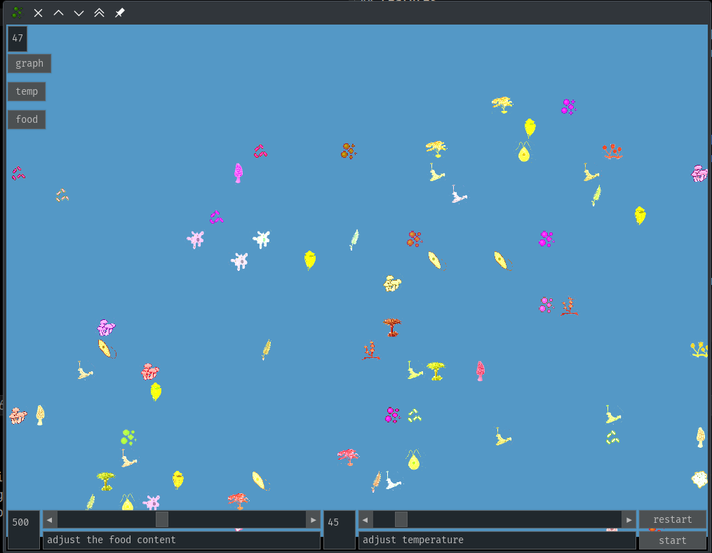

# Darwinio

 ```ascii
 ______   _______  _______          _________ _       _________ _______
(  __  \ (  ___  )(  ____ )|\     /|\__   __/( (    /|\__   __/(  ___  )
| (  \  )| (   ) || (    )|| )   ( |   ) (   |  \  ( |   ) (   | (   ) |
| |   ) || (___) || (____)|| | _ | |   | |   |   \ | |   | |   | |   | |
| |   | ||  ___  ||     __)| |( )| |   | |   | (\ \) |   | |   | |   | |
| |   ) || (   ) || (\ (   | || || |   | |   | | \   |   | |   | |   | |
| (__/  )| )   ( || ) \ \__| () () |___) (___| )  \  |___) (___| (___) |
(______/ |/     \||/   \__/(_______)\_______/|/    )_)\_______/(_______)
 ```

This is a Python program that simulates the process of evolution, complete with
organisms, genetic codes, and neural networks.

## Features

- You get to randomly generate organisms, and see how they evolve.
- Change the conditions while the simulation is running.
- You can control - Food and Temperature

## Screenshot




## Setup

### *Nix(Gnu-Linux, *BSD, MacOS)

1. Make sure your python is up-to date
2. Open your terminal, and install darwinio by running
   ```bash
   pip install darwinio
   ```
3. To run the program,
   ```bash
   python -m darwinio
   ```

### Microsoft Windows

1. Make sure you python is up-to date, if you don't have python installed
   install a recent version from [python's official website.](https://python.org/).
2. Open your terminal/Powershell, and install darwinio by running
   ```powershell
   py -m pip install darwinio
   ```
3. To run the program,
   ```powershell
   py -m darwinio
   ```

## Building and testing

### *Nix(Gnu-Linux, *BSD, MacOS)

1. Clone the repository to your local machine using the following command in your terminal
    ```
    git clone https://github.com/tusharhero/darwinio.git
    ```
2. Create a virtual environment and source it
   ```
   python -m venv .venv
   source ./.venv/bin/activate
   ```
3. Get the requirements
   ```
   pip install build
   ```
4. Build and install it
   ```
   python -m build
   pip install .
   ```
5. Test it by running it.
   ```
   python -m darwinio
   ```
## License

This program is copyright © 2023 Tushar Maharana <tusharhero@sdf.org>,
and Mihir Nallagonda <adhikshithamihir@gmail.com>.

This program is licensed under the terms of the
[GNU GENERAL PUBLIC LICENSE VERSION 3](./LICENSE.md) which means this is Free Software.
